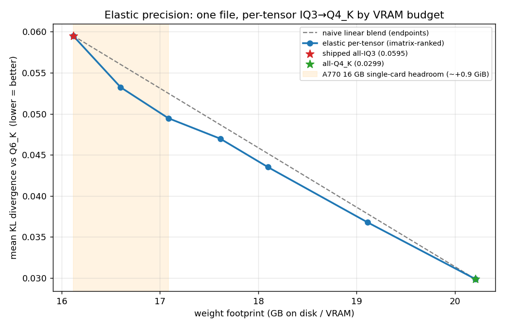

# Elastic precision — proof of premise (one file, per-tensor IQ3→Q4_K by VRAM budget)

**Question.** The shipped Turbo Phase Twin offers two *global* operating points — all-IQ3
(15.0 GiB, 1 card) and all-Q4_K (18.8 GiB, 2 cards). Between them lies a continuum: promote
only the *most important* expert tensors from IQ3_A770 (3.19 bpw) to Q4_K (4.5 bpw), ranked
by imatrix importance, and stop at whatever VRAM budget you have. Does that continuum buy
real quality — specifically, can the ~0.9 GiB of unused headroom on a single 16 GB A770 lower
KLD for free?

**Answer: yes, and the frontier is convex** — every intermediate mix beats a naive linear
blend, so a load-time budget knapsack provably dominates both fixed endpoints.

## Method

- **Granularity:** the 120 MoE expert tensors (40 layers × {down,gate,up}). The shipped
  `mixed-LUT` base is 80 IQ3_A770 + 24 Q4_K + 16 Q3_K experts; `Q4fill` is 120 Q4_K → **96
  tensors are promotable** (gate & up share an FFN input so they promote in pairs).
- **Ranking** (`scripts/rank-experts.py`): score each tensor by imatrix importance
  `mean(in_sum2/counts)` (the same signal `rank-down-layers.py` / the K-quant scale search
  use), greedily promote by importance-per-byte. Dequant-free, imatrix-only.
- **Build** (`scripts/stitch-mixed.py`): stitch a plain mixed GGUF — promoted tensors from
  `Q4fill`, the rest from `mixed-LUT`. Bit-identical to what a per-tensor load-time selector
  would pick, so its KLD *is* that operating point's quality.
- **Eval:** mean KLD vs a Q6_K reference over wikitext-2, CPU (device-independent quality,
  per the project standard). See *Caveats* for the reference size and the LUT gotcha.

## Results (mean KLD vs Q6_K, 20-chunk reference, CPU)

| footprint (GB) | Δ vs IQ3 | experts promoted | mean KLD ↓ | top-1 % ↑ | gap closed | vs linear blend |
|---|---|---|---|---|---|---|
| 16.12 (shipped all-IQ3) | +0.00 | 0 | 0.0595 | 90.12 | 0% | — |
| 16.60 | +0.48 | 11 | **0.0532** | 90.86 | 21% | −2.8 mKLD |
| 17.09 | +0.97 | 22 | **0.0495** | 90.92 | 34% | −3.0 mKLD |
| 17.61 | +1.50 | 34 | 0.0470 | 91.10 | 42% | −1.7 mKLD |
| 18.10 | +1.98 | 45 | 0.0435 | 91.75 | 54% | −1.7 mKLD |
| 19.11 | +3.00 | 68 | 0.0368 | 91.78 | 77% | −1.0 mKLD |
| 20.21 (all-Q4_K) | +4.09 | 96 | 0.0299 | 93.31 | 100% | — |

`gap closed` = fraction of the IQ3→Q4_K KLD gap (0.0595→0.0299) captured. `vs linear blend` =
how far the point sits *below* the straight line between the two endpoints — positive
everywhere ⇒ **convex / super-linear**: importance-first spending always beats uniform.

## The single-card headline (the actual A770 product)

The shipped all-IQ3 model is **15.0 GiB**; a 16 GB A770 has ~15.5–15.9 GiB usable. That
headroom is currently wasted. Spending it via per-tensor promotion, **same single card, same
0007/0008 kernels (both already run IQ3 and Q4_K MoE reorder), zero new hardware:**

- **+0.5 GB → 15.46 GiB** (fits with KV headroom at typical context): KLD **0.0595 → 0.0532**,
  **−10.6%**, 21% of the way to all-Q4_K.
- **+1.0 GB → 15.91 GiB** (single-card ceiling): KLD **→ 0.0495**, **−16.9%**, 34% of the gap —
  for free, on one card.

## Decision: GO — and **patch 0011 is now built + validated**

Premise proven, then shipped. `select_tensor_variant` (0010) was extended to a load-time
**budget knapsack**: `general.tensor_variant.budget_mb` (overridable via `--override-kv`) +
an embedded `general.tensor_variant.promote_order` manifest (the ranking here) → start every
expert at IQ3, greedily promote to Q4_K by importance/byte until the footprint fits. Patch:
[`../../patches/wip/0011-llama-elastic-budget-tensor-variant.partial.patch`](../../patches/wip/0011-llama-elastic-budget-tensor-variant.partial.patch)
(applies on 0010, upstream-safe — `budget_mb` absent/0 ⇒ unchanged behavior).

**Validated (build-iq3nl, the dual rebuilt with `merge-tensor-variants.py --ranking`):**

| budget | loader `select_tensor_variant` | matches `prune-dual.py`? |
|---|---|---|
| 15400 MiB | `selected 15.03 GiB (1/120 promoted)` | ✓ 1 |
| 16400 MiB | (24 promoted) | ✓ 24 |
| 25000 MiB | `selected 18.81 GiB (96/120 promoted)` = all-Q4 | ✓ 96 |
| default / `default=int:1` | global variant 0 / variant 1 | 0010 back-compat ✓ |

**Autoprune + one-command install** (the "fit it and drop the excess" path):
[`../../scripts/prune-dual.py`](../../scripts/prune-dual.py) runs the *same* greedy selection
and materializes a plain single-variant GGUF; [`../../serving/install-nx2.sh`](../../serving/install-nx2.sh)
detects VRAM → picks budget → autoprunes → launcher. End-to-end verified: `--vram-gib 16` →
**16.5 GB fitted model (9 experts promoted), loads & generates coherently** as a standalone file.

**No new model file** — the already-published `Nex-N2-mini-Turbo-Phase-Twin.gguf` already
carries both variants per tensor, so re-running `merge-tensor-variants.py --ranking` (or just
adding the `promote_order` KV) turns that exact file elastic to any VRAM, on any card.

## Caveats (honest)

- **20-chunk reference**, not the published 100-chunk one — `llama-perplexity --kl-divergence`
  ignores `--chunks` (it loops over the base file's chunk count: `perplexity.cpp:1725/1794`),
  so a 20-chunk Q6_K reference was rebuilt via the save path (which does honor `--chunks`) to
  keep each CPU eval ~15 min instead of ~75. This inflates absolute KLD ~9–22% uniformly vs
  100-chunk (all-IQ3 0.0595 here ≈ published 0.0547; all-Q4 0.0299 ≈ published 0.0245;
  top-1 90.1% ≈ 89.9%). The **curve shape, convexity, and relative gaps are unaffected** — a
  100-chunk rerun would shift every point down by a near-constant factor.
- **Quality is on CPU** (device-independent); **throughput is not measured here** and would be
  B70-proxy only (A770 is the product, B70 the dev card).
- **LUT gotcha (cost a full bad sweep):** IQ3_A770 CPU eval must use a binary whose
  `kvalues_iq3nl` codebook matches the model. `build-cpu-iq3` (pre-LUT-redesign, old uniform
  `x=d·sc·(q−4)`) produced garbage (KLD 3.40, PPL ~149); `build-iq3nl` (NF3 LUT, matches the
  `mixed-LUT` model) reproduces the baseline (KLD 0.0595, PPL ~5.2). All numbers above are
  `build-iq3nl`. The discarded bad run is preserved as `pareto.BADLUT.csv`.

## Artifacts

`pareto.csv` (data) · `pareto.png` (curve) · `pareto_table.md` · `kld/*.log` (raw evals) ·
`promote_*gb.json` (per-budget promote-sets) · `ranking.csv` (full 120-tensor ranking).
Tools: `scripts/{rank-experts,stitch-mixed,plot-elastic}.py`, `scripts/elastic-sweep.sh`.
